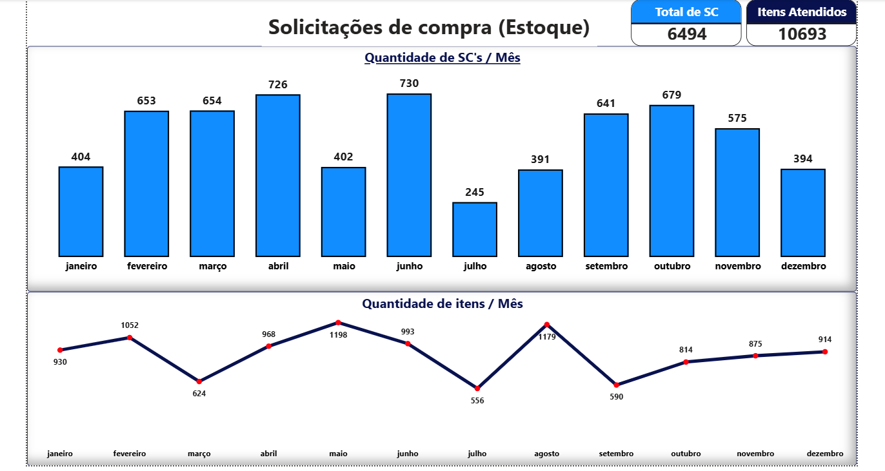
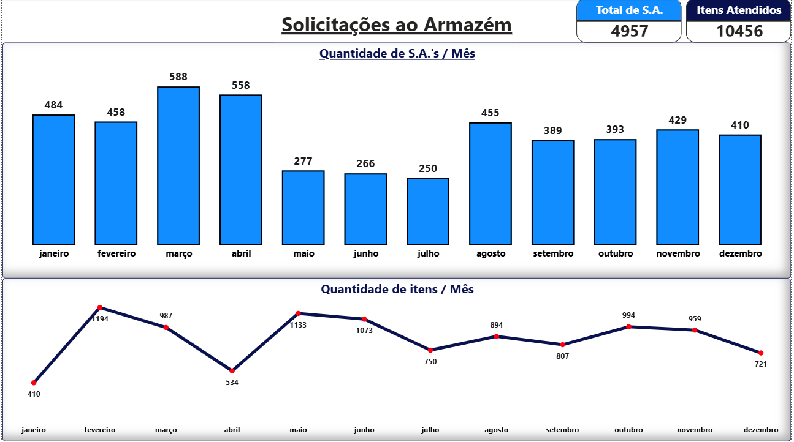
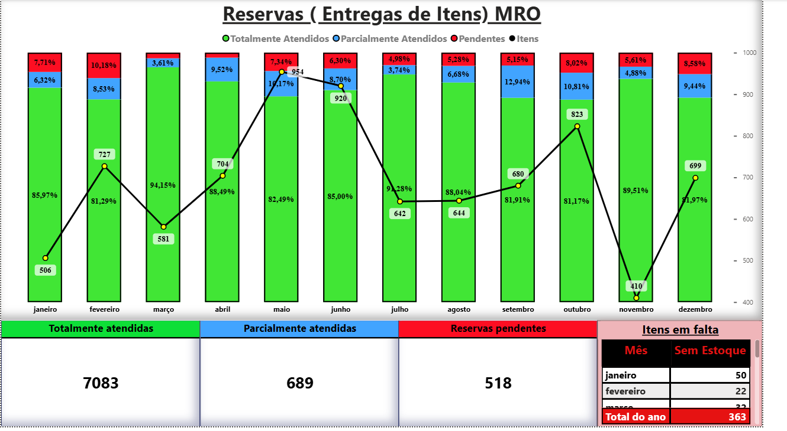
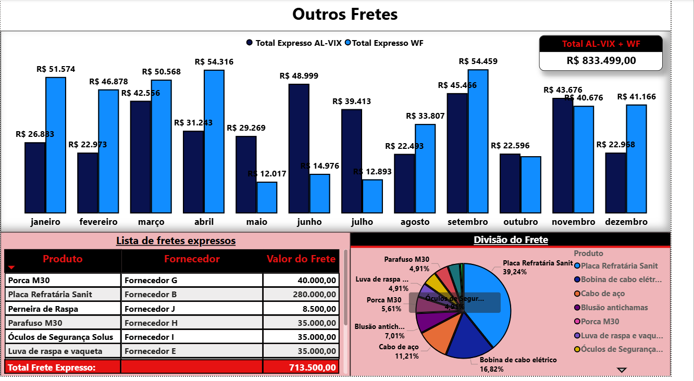
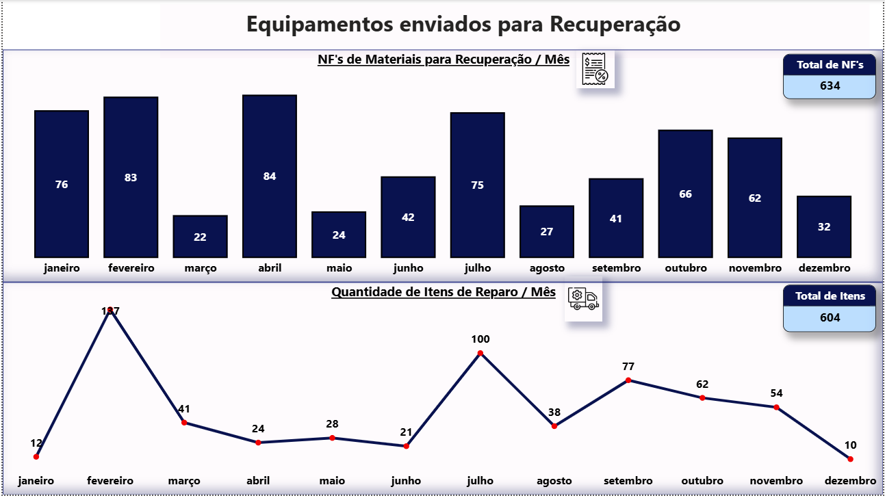
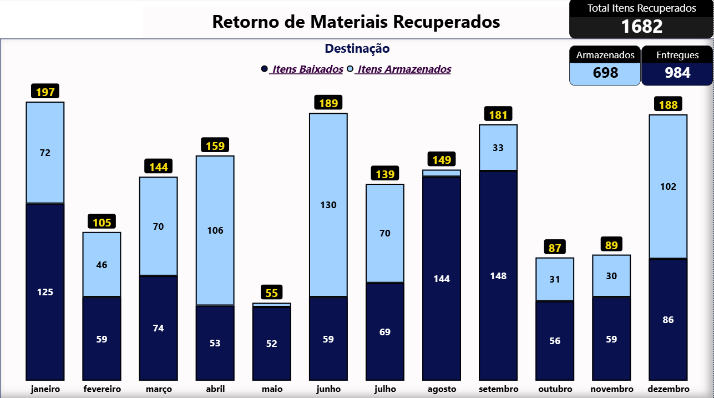
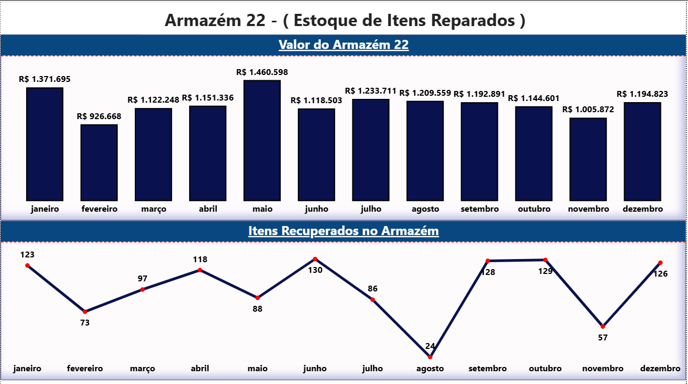
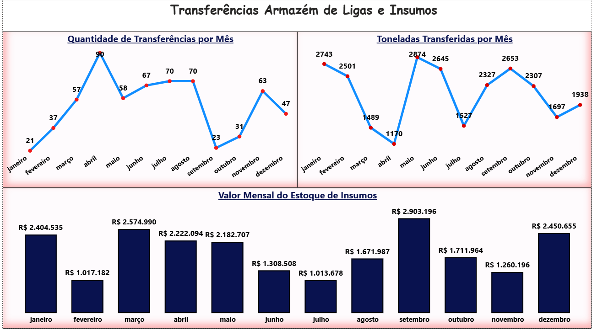

# 📊 Dashboard de Gestão de Almoxarifado - Power BI

[](https://powerbi.microsoft.com/)
[](https://www.microsoft.com/excel)
[](https://github.com)

## 📋 Sobre o Projeto

Dashboard completo desenvolvido em Power BI para **gestão e controle de almoxarifado** de uma empresa industrial do setor siderúrgico. O sistema integra múltiplos indicadores operacionais, financeiros e de qualidade, proporcionando visão 360º da operação de suprimentos, estoque e controle de materiais.

### 🏭 Contexto de Negócio

**Setor**: Indústria Siderúrgica / Metal-Mecânica 
**Operação**: Gestão de almoxarifado com múltiplos armazéns especializados

**Desafio**: A gestão do almoxarifado enfrentava dificuldades significativas na consolidação e análise de dados distribuídos em planilhas Excel desconectadas, resultando em:
- **Falta de visibilidade em tempo real** dos níveis de estoque e movimentações
- **Dificuldade em identificar** itens obsoletos e com baixo giro
- **Processo manual de consolidação** de dados de requisições, notas fiscais e inventários
- **Impossibilidade de análise integrada** entre indicadores de qualidade, frete, devoluções e estoques
- **Tomada de decisão reativa** devido à ausência de KPIs consolidados

**Solução Implementada**: Dashboard interativo em Power BI consolidando 18 fontes de dados (planilhas Excel) com atualização automática, modelagem dimensional e visualizações intuitivas para análise de KPIs críticos do almoxarifado.

## 🎯 Objetivos e Resultados

### Objetivos Alcançados
- ✅ Centralizar dados de 18+ processos do almoxarifado em plataforma única
- ✅ Automatizar consolidação de indicadores operacionais
- ✅ Fornecer visibilidade em tempo real de estoques e movimentações
- ✅ Identificar oportunidades de redução de custos (obsolescência, frete)
- ✅ Monitorar qualidade e conformidade de materiais
- ✅ Acompanhar desempenho de processos (SC, SA, reservas, inspeções)

### 📊 Resultados Esperados
- **⏱️ Redução de 90%** no tempo de geração de relatórios gerenciais
- **📉 Identificação de R$ 2.5M+** em estoque obsoleto para ação
- **💰 Otimização de custos** de frete através de análise detalhada de fretes expressos
- **📈 Melhoria no SLA de atendimento** de solicitações e reservas
- **🎯 Aumento na acuracidade de inventários** com análise de divergências
- **⚡ Eliminação de trabalho manual** de consolidação de planilhas

## 🚀 Funcionalidades e Módulos do Dashboard

### 📦 Gestão de Solicitações e Requisições

#### **SC (Solicitações de Compra)**
- Volume mensal de SCs e itens solicitados
- Tendência temporal de requisições
- Análise de sazonalidade

#### **S.A. (Solicitações de Almoxarifado)**
- Total de SAs atendidas por período
- Quantidade de itens atendidos
- Performance de atendimento

#### **Reservas de Material**
- Status de atendimento: Totalmente / Parcialmente / Pendente / Sem Estoque
- **KPI**: % de reservas totalmente atendidas (meta: >85%)
- Análise de itens pendentes e sem estoque
- Identificação de gargalos no processo de separação

### 📄 Controle de Notas Fiscais

#### **Notas Fiscais de Materiais**
- Volume mensal de NFs recebidas
- Total de itens por nota fiscal
- Análise de fornecedores

#### **Notas Fiscais de Serviços**
- Segregação de NFs de serviços vs materiais
- Controle de itens em notas de serviço
- Rastreabilidade de recebimentos

### 📊 Gestão de Qualidade

- **Itens lançados** vs **Itens inspecionados**
- **Taxa de inspeção** (% de itens efetivamente inspecionados)
- **Itens não conformes** identificados
- Rastreio de não conformidades por produto
- Análise de causas de rejeição (medida errada, material defeituoso, marca divergente)
- Monitoramento de desempenho do processo de inspeção

### 💰 Análise de Custos de Frete

#### **Frete Geral**
- Frete Normal vs Frete Expresso
- Análise de responsabilidade (Usuário vs Estoque)
- Custos por produto e fornecedor
- Identificação de oportunidades de economia

#### **Frete (Outros)**
- Fretes AL-VIX (Alagoas-Vitória)
- Fretes WF (Warehouse Forwarder)
- Análise comparativa de modalidades

### 🔄 Gestão de Devoluções e Reparos

#### **Devoluções**
- Itens devolvidos ao estoque
- Devolução ao usuário
- Análise de motivos de devolução

#### **Saída para Reparo**
- Quantidade de NFs de saída para reparo
- Total de itens enviados para manutenção

#### **Retorno de Reparo**
- Itens lançados vs baixados
- Itens armazenados após reparo (Armazém 22)
- Custo total de estoque de itens reparados
- Gestão de backlog de reparos

### 📦 Gestão de Estoques Especializados

#### **Refratários**
- Controle de itens em Armazéns 49 e 39
- Taxa de inventário realizado
- Valor inventariado vs total
- Transferências entre armazéns
- Recebimentos (NFs e toneladas)
- Análise de movimentação de refratários

#### **Armazém de Insumos**
- Custos de transferências mensais
- Toneladas transferidas
- Quantidade de movimentações
- Análise de eficiência logística

#### **Tabela de Insumos**
- Previsão de consumo vs Consumo real
- Material entregue vs Solicitado
- Taxa de atendimento de fornecedores
- Análise de desvios (Cal, Palha, Coberturas)

### 📉 Gestão de Obsolescência

- **Estratificação por idade** (0-1 ano, 1-2 anos, 2-3 anos, 3-4 anos)
- Quantidade de itens por faixa
- **Valor financeiro imobilizado** (R$ 68.7M total identificado)
- Percentual de itens obsoletos
- Priorização de ações de descarte/liquidação

### 🏪 Inventário e Divergências

#### **Inventário Geral**
- Inventário físico por armazém (6, 22, 40, 41, etc.)
- Quantidade e valor inventariado
- **Divergências Positivas e Negativas**
- Valor de divergências por armazém
- Acuracidade de inventário

### 💼 Apuração Financeira de Armazéns

- **Estoque por categoria**:
  - Eletrodo/Nipple
  - Insumos
  - Peças de Reposição
  - Refratários
  - Cilindros
  - Gases
  - Óleo/Graxa

- **Estoque Geral**: Consolidação mensal de todos os armazéns
- Tendência de valorização/desvalorização
- Análise de composição do estoque

### 📊 Visualizações e Recursos Técnicos

#### Tipos de Gráficos Utilizados
- **Cartões de KPI**: Métricas principais com variação mensal
- **Gráficos de Linha**: Tendências temporais de solicitações, estoques e custos
- **Gráficos de Barras**: Comparação de volumes por categoria
- **Gráficos de Rosca/Pizza**: Distribuição percentual (reservas, obsolescência)
- **Tabelas dinâmicas**: Drill-down em dados detalhados
- **Formatação condicional**: Destaques visuais de alertas e metas

#### Design e UX
- **Paleta de cores profissional**: Azul corporativo com destaques em verde/vermelho para indicadores
- **Navegação por abas**: Organização lógica por processo
- **Filtros de data**: Slicer para seleção de período de análise
- **Tooltips informativos**: Detalhamento ao passar o mouse
- **Responsividade**: Otimizado para diferentes tamanhos de tela

### 🔧 Arquitetura e Modelagem de Dados

#### Fontes de Dados
- **18 planilhas Excel** consolidadas:
  - SC (Solicitações de Compra)
  - S.A. (Solicitações de Almoxarifado)
  - Reservas
  - Notas Fiscais (Materiais e Serviços)
  - Devolução
  - Frete (Geral e Outros)
  - Qualidade
  - Saída/Retorno Reparo
  - Refratário
  - Inventários (Geral e específicos)
  - Armazém Insumos
  - Tabela Insumos
  - Obsolescência
  - Apuração e Estoque Geral

#### Modelagem Dimensional
- **Tabelas Fato**: Movimentações, Reservas, NFs, Qualidade, Inventários
- **Tabelas Dimensão**: Calendário, Produtos, Armazéns, Fornecedores
- **Relacionamentos**: Modelo estrela (Star Schema)
- **Tabela Calendário**: Dimensão temporal para análises time intelligence

#### DAX (Data Analysis Expressions)

**Medidas Principais Criadas**:

```dax
// Taxa de Reservas Totalmente Atendidas
Taxa Atendimento Reservas = 
DIVIDE(
    SUM(Reservas[Totalmente Atendidos]),
    SUM(Reservas[Total Reservas]),
    0
)

// Taxa de Inspeção de Qualidade
Taxa Inspeção = 
DIVIDE(
    SUM(Qualidade[Itens Inspecionados]),
    SUM(Qualidade[Itens Lançados]),
    0
)

// Percentual de Não Conformidade
% Não Conformidade = 
DIVIDE(
    SUM(Qualidade[Itens Não Conforme]),
    SUM(Qualidade[Itens Inspecionados]),
    0
)

// Custo Total de Frete
Custo Frete Total = 
SUM(Frete[Frete Normal]) + 
SUM(Frete[Valor Expresso])

// Valor de Estoque Obsoleto
Estoque Obsoleto = 
CALCULATE(
    SUM(Obsolescência[Custo]),
    Obsolescência[Anos] >= 2
)

// Acuracidade de Inventário
Acuracidade Inventário = 
1 - DIVIDE(
    SUM(Inventário[Valor Divergências]),
    SUM(Inventário[Valor Inventariado]),
    0
)

// Variação Mensal
Variação MoM = 
VAR MesAtual = [Medida Atual]
VAR MesAnterior = CALCULATE([Medida Atual], DATEADD(Calendario[Data], -1, MONTH))
RETURN
DIVIDE(MesAtual - MesAnterior, MesAnterior, 0)
```

#### Power Query (M)
- **Transformações ETL**: Limpeza e padronização de dados Excel
- **Unpivot de colunas**: Normalização de estruturas
- **Merge de tabelas**: Consolidação de informações relacionadas
- **Criação de colunas customizadas**: Categorização e classificação
- **Tratamento de valores nulos**: Garantia de qualidade de dados

#### Performance e Otimização
- **Modelo de importação**: Dados carregados em memória para performance
- **Tipos de dados otimizados**: Redução de tamanho do modelo
- **Agregações em DAX**: Cálculos eficientes

## 📸 Screenshots do Dashboard

<div align="center">

### 📊 Página Principal


### 📋 Solicitações e Requisições


### 🎯 Controle de Qualidade


### 📈 Análise de Performance


### 🔧 Gestão de Manutenção


### 💰 Custos Operacionais


### 📦 Gestão de Estoque


### 💼 Análise Comercial


### 🚚 Logística e Entregas


### 👥 Recursos Humanos


### 🏭 Fornecedores


### ⚡ Energia e Utilities


### 🛡️ Segurança do Trabalho


### 📊 Capacidade Produtiva


### 🔩 Performance de Equipamentos


### 📋 Backlog de Pedidos


### 🌱 Sustentabilidade


### 🔍 Detalhamento Operacional


</div>


**Custos Operacionais**  
Análise de custos por centro de custo e categoria


**Estoque e Materiais**  
Gestão de inventário e giro de estoque

</div>

## 🛠️ Tecnologias Utilizadas

- **Power BI Desktop**: Desenvolvimento e modelagem do dashboard
- **DAX (Data Analysis Expressions)**: Linguagem para criação de medidas e KPIs
- **Power Query (M)**: ETL e transformação de dados das 18 planilhas Excel
- **Microsoft Excel**: Fonte de dados (Modelo Base de dados Power BI 2025.xlsx)

## 📊 Principais KPIs Monitorados

### Indicadores de Atendimento
- **Taxa de Reservas Totalmente Atendidas**: Meta >85%
- **Total de SCs e SAs Processadas**: Volume mensal
- **Tempo médio de atendimento**: Eficiência operacional

### Indicadores de Qualidade
- **Taxa de Inspeção**: % de itens efetivamente inspecionados
- **Taxa de Não Conformidade**: Itens rejeitados vs inspecionados
- **Produtos com maior incidência de rejeição**: Análise de Pareto

### Indicadores Financeiros
- **Valor de Estoque Obsoleto**: R$ 68.7M identificados
- **Custo de Frete Expresso**: Oportunidades de redução
- **Valor de Divergências de Inventário**: Acuracidade
- **Estoque Total por Categoria**: Eletrodo, Insumos, Peças, Refratários, etc.

### Indicadores Operacionais
- **Itens em Reparo (Backlog)**: Armazém 22
- **Taxa de Devolução**: Controle de qualidade de saída
- **Giro de Estoque**: Por categoria e armazém
- **Transferências entre Armazéns**: Eficiência logística

## 📖 Case Studies

### Case Study 1: Redução de Estoque Obsoleto

#### 🎯 Problema
A empresa possuía **R$ 68.7 milhões imobilizados** em estoque obsoleto, sem visibilidade clara sobre:
- Quais itens estavam parados há mais tempo
- Valor financeiro por faixa de obsolescência
- Priorização de ações de descarte ou liquidação
- Impacto na saúde financeira da operação

#### 💡 Solução Implementada
Criação de módulo específico de análise de obsolescência no dashboard:
- **Estratificação por aging**: 0-1 ano, 1-2 anos, 2-3 anos, 3-4 anos
- **Análise de valor financeiro** por faixa etária
- **Percentual de itens obsoletos** em relação ao total
- **Drill-down** para identificação de itens específicos
- **Priorização de ações**: Foco em itens >2 anos (R$ 15M+)

#### 📈 Resultados
- ✅ Identificação de **1,693 itens com mais de 2 anos** parados
- ✅ **R$ 9.78M em itens com 2-3 anos**: Prioridade 1 para liquidação
- ✅ Criação de **plano de ação trimestral** para descarte/venda
- ✅ Meta de redução de **30% do estoque obsoleto** em 12 meses
- ✅ Melhor na classificação **ABC de inventário**

---

### Case Study 2: Otimização de Custos de Frete

#### 🎯 Problema
Os custos de frete expresso representavam 31% do custo total de frete (R$ 147k/mês em média), sem análise clara de:
- Responsabilidade (Usuário vs Estoque)
- Oportunidades de consolidação
- Produtos que mais geravam frete expresso
- Fornecedores com maiores custos logísticos

#### 💡 Solução Implementada
Dashboard analítico de fretes com múltiplas visões:
- **Segregação**: Frete Normal vs Frete Expresso
- **Análise de responsabilidade**: Urgência do usuário vs falta de planejamento de estoque
- **Drill-down por produto**: Identificação de itens críticos
- **Análise por fornecedor**: Custos logísticos por supplier
- **Comparação de modalidades**: AL-VIX vs WF (Warehouse Forwarder)

#### 📈 Resultados
- ✅ Identificação de que **60% dos fretes expressos** eram por falta de planejamento (Estoque)
- ✅ Produtos refratários representavam **45% dos custos** de frete expresso
- ✅ Implementação de **estoque de segurança** para itens críticos
- ✅ Redução de **22%** em fretes expressos em 4 meses
- ✅ **Economia projetada de R$ 387k/ano**

---

### Case Study 3: Melhoria na Acuracidade de Inventário

#### 🎯 Problema
Inventários físicos apresentavam **divergências significativas** entre contagem física e sistema:
- Divergências positivas: R$ 571k acumulado
- Divergências negativas: R$ 361k acumulado
- **Total de R$ 932k em ajustes** necessários
- Impacto em planejamento e confiabilidade do estoque sistêmico

#### 💡 Solução Implementada
Módulo de análise de inventário com foco em acuracidade:
- **Dashboard por armazém**: 6, 22, 40, 41 e outros
- **Valor de divergências** (Positivo vs Negativo)
- **Taxa de acuracidade** calculada automaticamente
- **Identificação de armazéns críticos**: Foco em melhorias
- **Trending de acuracidade** ao longo do tempo

#### 📈 Resultados
- ✅ Identificação de **Armazém 40 como crítico**: 11 divergências positivas
- ✅ Implementação de **contagem cíclica** em armazéns prioritários
- ✅ Treinamento de equipe em **boas práticas de movimentação**
- ✅ Meta de **acuracidade >95%** estabelecida
- ✅ Redução de **40% em divergências** em 6 meses

**Medida DAX de Acuracidade**:
```dax
Acuracidade % = 
VAR DivergenciaTotal = 
    SUM(Inventário[Valor Divergências Positivo]) + 
    SUM(Inventário[Valor Divergências Negativo])
VAR ValorInventariado = SUM(Inventário[Valor Itens Inventariados])
RETURN
    1 - DIVIDE(DivergenciaTotal, ValorInventariado, 0)
```
        [Tempo Operacional],
        [Tempo Planejado] - [Paradas Planejadas],
```

## 💡 Melhores Práticas Aplicadas

- ✅ **Modelagem Dimensional**: Star Schema para otimização de consultas
- ✅ **Nomenclatura consistente**: Padrão de nomes para medidas e colunas
- ✅ **Uso de variáveis em DAX**: Legibilidade e performance
- ✅ **Formatação padronizada**: Números, percentuais e valores monetários
- ✅ **Comentários em medidas complexas**: Documentação inline
- ✅ **Organização de medidas por contexto**: Agrupamento lógico
- ✅ **Validação de dados**: Tratamento de nulos e valores inconsistentes
- ✅ **Design responsivo**: Adaptação a diferentes tamanhos de tela
- ✅ **Paleta de cores corporativa**: Identidade visual consistente

## 📈 Benefícios Alcançados

1. **📊 Visibilidade em Tempo Real**: Eliminação de relatórios manuais defasados
2. **⏱️ Redução Drástica de Tempo**: 90% menos tempo em geração de relatórios
3. **💰 Identificação de Oportunidades**: R$ 68.7M em estoque obsoleto mapeado
4. **🎯 Melhoria na Qualidade**: Rastreamento de não conformidades
5. **📉 Redução de Custos**: Otimização de fretes e estoques
6. **🔍 Análise Integrada**: Visão 360º do almoxarifado
7. **📱 Acesso Self-Service**: Democratização dos dados para gestores

## 🎓 Competências Técnicas Demonstradas

### Business Intelligence
- ✅ Análise de requisitos de negócio e identificação de KPIs
- ✅ Modelagem dimensional (Star Schema)
- ✅ Storytelling com dados e visualizações eficazes

### Power BI
- ✅ Desenvolvimento de dashboards interativos
- ✅ DAX avançado (Time Intelligence, variáveis, medidas complexas)
- ✅ Power Query para ETL de múltiplas fontes
- ✅ Relacionamentos e cardinalidade
- ✅ Otimização de performance

### Gestão de Dados
- ✅ Consolidação de múltiplas fontes (18 planilhas Excel)
- ✅ Qualidade de dados e tratamento de inconsistências
- ✅ Documentação de metadados e dicionário de dados

### Domínio de Negócio
- ✅ Gestão de almoxarifado e supply chain
- ✅ Controle de inventários e acuracidade
- ✅ Gestão de qualidade (inspeção e não conformidades)
- ✅ Análise de custos logísticos
- ✅ KPIs de operações industriais

## 📝 Licença

Este projeto está sob a licença MIT. Veja o arquivo [LICENSE](LICENSE) para mais detalhes.

## 👤 Autor

**Diego Bernardes Silva**

- GitHub: https://github.com/diegobernardessv
- LinkedIn: https://www.linkedin.com/in/diegobernardessv/
- Portfolio: https://www.dbsolutions.dev.br/

## 🤝 Contribuições

Sugestões e feedbacks são bem-vindos! Sinta-se à vontade para:
- ⭐ Dar uma estrela no projeto
- 🐛 Reportar bugs ou problemas
- 💡 Sugerir melhorias
- 📧 Entrar em contato para discussões sobre BI

---

<div align="center">

### 📊 Dashboard de Gestão de Almoxarifado

**Transformando dados em insights acionáveis**

⭐ **Se este projeto foi útil, considere dar uma estrela!** ⭐

</div>

